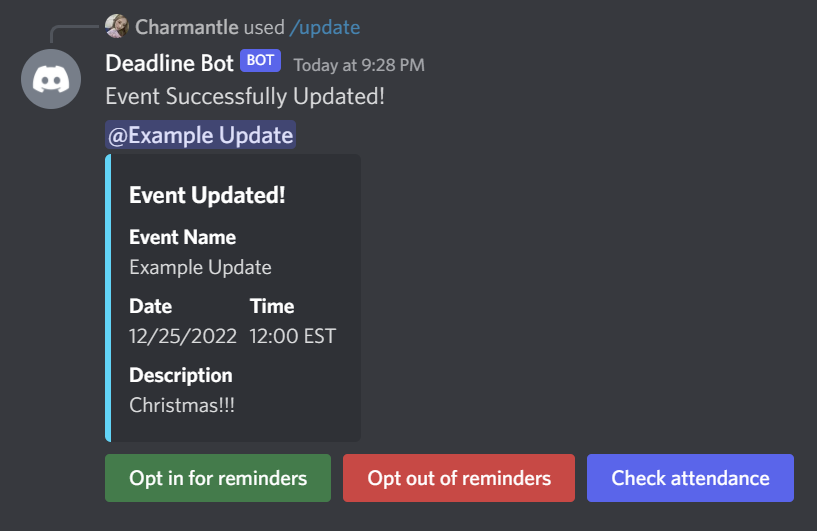

# Deadline Discord Bot

## Table of Contents
* [General Info](#general-information)
* [Technologies Used](#technologies-used)
* [Features](#features)
* [Screenshots](#screenshots)
* [Setup](#setup)
* [Usage](#usage)
* [Project Status](#project-status)
* [Room for Improvement](#room-for-improvement)
* [Acknowledgements](#acknowledgements)
* [Contact](#contact)

## General Information
- The Deadline Discord Bot is designed to remind people of upcoming events via roles and pings.
- Because of our lives, sometimes we get sidetracked from the events we plan. With this Discord bot, you will no longer have to worry about remembering any deadlines/events coming up.
- After taking learning basic Python in my high school Artificial Intelligence class, I wanted to expand my knowledge and experience programming for real world applications with tools such as Heroku, Github, and databases. 

## Technologies Used
- Python - version 3.10.6
- Py-cord - version 2.0.1
- APScheduler - version 3.9.1
- Python-dotenv - version 0.20.0
- Heroku - Version 20

## Features
- Create deadlines for events at any time
- Update deadlines for any change of plans
- Delete deadlines
- Opt in or out of reminders for deadlines
- Check attendance list to see who is receiving reminders
- See list of all events in a server

## Screenshots

## Setup
- [Requirements](requirements.txt)
- [Add bot to your server](https://discord.com/api/oauth2/authorize?client_id=1005144008126894200&permissions=8&scope=bot%20applications.commands)

## Usage

- " * " stands for an optional input

### Create Deadline

`/deadline {event_name} {month} {day} {year} {hour} {minute} {channel} {timezone} {*description}` - Creates new event.

- ***event_name***: Name of the event you will make the deadline for. It will also be the name of the role that the command will create.
- ***month***: The month of the deadline date. The command will give you the list of all the months to choose from.
- ***day***: The day of the deadline date. You must enter the correct day for each month. For example, entering 31 for the month of September will not work.
- ***year***: The year of the deadline date. By default the minimum year will be the current year.
- ***hour***: The hour of the deadline date. You must enter value between 0 and 23 where 0 stands for 12:00 AM and 23 stands for 11:00 PM
- ***minute***: The minute of the deadline date. You must enter a value between 0 and 59.
- ***timezone***: Timezone that the deadline will be in.
- ***channel***: This will be the channel that the bot will send reminders to. This does not include updates to deadlines/events.
-  ***description***: A description is optional. This is where you can put any extra details such as where to meet up or what is going to happen at the event.

### Update Event

`/update {event_name} {timezone} {*new_event_name} {*month} {*day} {*year} {*hour} {*minute} {*channel} {*description}`  - updates selected event

- ***event_name***: Name of the event you will update. Comes in the form of a role, meaning you must select a role that the bot as created or else an error will be raised.
- ***timezone***: Timezone that the updated datetime object will be in. Must be selected if you are updating the deadline.
- ****new_event_name***: New name for the of event you want to change. This will also change the role name.
- ****month***: The month of the deadline date. The command will give you the list of all the months to choose from.
- ****day***: The day of the deadline date. You must enter the correct day for each month. For example, entering 31 for the month of September will not work.
- ****year***: The year of the deadline date. By default the minimum year will be the current year.
- ****hour***: The hour of the deadline date. You must enter value between 0 and 23 where 0 stands for 12:00 AM and 23 stands for 11:00 PM
- ****minute***: The minute of the deadline date. You must enter a value between 0 and 59.
- ****channel***: This will be the channel that the bot will send reminders to. This does not include updates to deadlines/events.
-  ****description***: A description is optional. This is where you can put any extra details such as where to meet up or what is going to happen at the event.

### Delete Event

`/delete {event_name}` - deletes selected event

- ***event_name***: Name of the event you will delete. Comes in the form of a role, meaning you must select a role that the bot as created or else an error will be raised.

### Opt out for reminders

`/opt-in {event_name}` - puts user on attendance list so that they recieve reminders.

- ***event_name***: Name of the event you will get reminders for. Comes in the form of a role, meaning you must select a role that the bot as created or else an error will be raised.

### Opt out of reminders

`/opt-out {event_name}` - takes user off attendance list so that they no longer recieve reminders.

- ***event_name***: Name of the event you want to no longer receive notifications for. Comes in the form of a role, meaning you must select a role that the bot as created or else an error will be raised.

### Get attendance

`/get-attendance {event_name}` - returns an embed containing list of member names and the number of people recieving reminders.

- ***event_name***: Name of the event you want to see attendance of. Comes in the form of a role, meaning you must select a role that the bot as created or else an error will be raised.

### Get events

`/get-events` - returns embed containing all event names, their deadlines, and attendance count.

### Buttons
- ***Opt in for reminders***: Does the exact same as the opt-in command.
- ***Opt out of reminders***: Does the exact same as the opt-out command.
- ***Check attendance***: Shows a list of people who are currently receiving reminders.

## Project Status
Project is: _in progress_ 

## Room for Improvement
Room for improvement:
- Add more flexible reminder scheduling

<<<<<<< HEAD
<<<<<<< Updated upstream
To do:
- Get list of events

=======
>>>>>>> Stashed changes
=======
>>>>>>> redesign
## Acknowledgements
- Many thanks to the [Pycord Discord Server](https://discord.gg/ySu2u8Ff) for helping me through many roadblocks

## Contact
Created by [@HecticBanzai](https://github.com/HecticBanzai) - feel free to contact me!

<!-- Optional -->
<!-- ## License -->
<!-- This project is open source and available under the [... License](). -->

<!-- You don't have to include all sections - just the one's relevant to your project -->